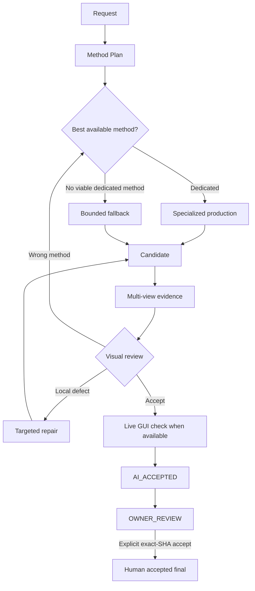

<div align="center">

# BlendSmith

### A production harness for AI-assisted Blender

**Choose better methods. Inspect real evidence. Repair deliberately. Stop at human approval.**

[](pyproject.toml)
[](https://www.blender.org/)
[](LICENSE)

</div>

BlendSmith is a model-independent orchestration harness for Blender agents. It does not replace the model, Blender, MCP, `bpy`, or GUI automation. It manages the production process around them: **method selection, evidence, visual review, repair, checkpointing, exact human approval, retention, and verified publication**.

> Modern models can already build impressive 3D assets. BlendSmith exists because **being able to build something is not the same as consistently choosing the right Blender method, inspecting the result, recovering safely, and handing an exact reviewed artifact to a human.**

## What can this workflow produce?

The private Blender harness that evolved into BlendSmith was already producing work like this with **GPT-5.6 Sol High**. These are real outputs from that workflow, not mockups.

<p align="center">
  
</p>

<table>
  <tr>
    <td width="50%" align="center"></td>
    <td width="50%" align="center"></td>
  </tr>
  <tr>
    <td align="center"><b>Jewelry / dense ornamental detail</b></td>
    <td align="center"><b>Gemstone / hard-surface asset work</b></td>
  </tr>
</table>

BlendSmith is the public, model-neutral harness distilled from that production workflow. Output quality still depends on the model, references, available Blender capabilities, and iteration; BlendSmith governs the process rather than pretending to be the artist itself.

### Current-generation dogfood

BlendSmith was also tested internally with **Astra** on an ornate sword task. The model independently revised an earlier candidate, while BlendSmith still provided useful production discipline: method discovery, exact candidate pinning, multi-view evidence, live-GUI verification, and a hard stop at `OWNER_REVIEW`. The render is intentionally not included here; this is an orchestration claim, not a model benchmark.

## The idea in one diagram



**The agent can propose progress. BlendSmith Core decides whether that progress is valid. The owner decides whether the exact reviewed artifact is accepted.**

## Why BlendSmith?

| Common agent failure | BlendSmith response |
| --- | --- |
| The model knows a Blender feature exists, but forgets to use it | **Method Selection Gate** — specialized methods are evaluated before production |
| A candidate exists, so the agent declares success | **Evidence-backed review** — actual views must be opened and evaluated |
| Endless hand-tweaking after choosing the wrong approach | **Method reconsideration** — route back to method selection instead of patching forever |
| The agent says “looks good” | **AI acceptance is separate from human acceptance** |
| A file changes after review | **SHA-bound authority** — approval names the exact reviewed bytes |
| GUI capability breaks | **No silent downgrade** — `BROKEN` / `UNKNOWN` cannot be disguised as `UNAVAILABLE` |
| A long run is interrupted | **Checkpoint / resume** — restore validated authority state rather than improvising from memory |
| Old heavy artifacts accumulate forever | **TTL + verified GC** — only eligible managed data can be cleaned up |

## Specialized first, scratch last

Knowing that Blender has `Mirror`, `Array`, Geometry Nodes, asset libraries, extensions, or reusable node tools is not the same as selecting them at the right time.

Before production, BlendSmith requires work-unit planning and a machine-validated method-selection receipt. The default discovery policy accounts for:

- Blender native functionality
- Geometry Node tools
- asset libraries
- installed extensions
- project-local catalogs
- configured adapters

Known method hints must be explicitly accounted for. A relevant specialized method left `UNKNOWN`, or a required discovery source left `BROKEN` / `UNKNOWN`, blocks fallback instead of silently authorizing scratch construction.

Examples of built-in discovery hints include:

```text
symmetry        -> Mirror
repetition      -> Array / Geometry Nodes
surface scatter -> Geometry Nodes
thickness       -> Solidify
lathe / revolve -> Screw
edge rounding   -> Bevel
hair            -> Geometry Nodes / Node Tool
tree generation -> extension / Node Tool / asset-library discovery
```

The goal is not to ban custom modeling. It is to make custom modeling the **intentional fallback**, not the agent's first reflex.

## Quickstart with Codex

### 1. Install BlendSmith from source

```bash
git clone https://github.com/Soph1yzzz/blendsmith.git
cd blendsmith
python -m pip install .
```

Python **3.11+** is required. Blender **5.2 LTS** is the primary runtime target.

### 2. Install the bundled Codex Skill

```bash
blendsmith skill-install
blendsmith doctor
```

`blendsmith doctor` fails closed unless the installed Skill matches the Skill bundled with the currently installed CLI/Core package.

Restart Codex after a fresh Skill install or update.

### 3. Ask Codex to use it

```text
BlendSmithを使って、この参考画像からBlenderで作って。
```

or:

```text
Use BlendSmith to build this in Blender.
```

The Skill is intentionally thin. It does not duplicate BlendSmith's state machine in prompt text; it queries the installed CLI/Core through `doctor`, `status`, command help, and authoritative JSON schemas.

## What happens after invocation?

A typical run looks like this:

```text
preflight
  -> method plan
  -> method selection
  -> Blender production
  -> candidate pin
  -> multi-view evidence
  -> visual review
       -> local repair, or
       -> method reconsideration
  -> live GUI review when available
  -> AI_ACCEPTED
  -> OWNER_REVIEW
```

At `OWNER_REVIEW`, automatic progress stops.

```text
AI_ACCEPTED != HUMAN_ACCEPTED
```

Human acceptance is bound to the exact candidate SHA-256 that was reviewed. BlendSmith does not infer approval from silence, an AI verdict, or a previous version of the file.

## Use the Core directly

BlendSmith is not Codex-only. The CLI/Core is the authority; the Codex Skill is one adapter.

```bash
blendsmith --version
blendsmith doctor
blendsmith init <project>
blendsmith preflight --project <project>
blendsmith start --project <project>
blendsmith status --project <project>
```

Authoritative contracts can be inspected directly:

```bash
blendsmith schema method_plan
blendsmith schema method_selection
blendsmith schema visual_review
```

Useful lifecycle commands include:

```bash
blendsmith method-hints --project <project> --intent symmetry
blendsmith method-plan --project <project> --input method_plan.json
blendsmith method-select --project <project> --input method_selection.json
blendsmith candidate-add --project <project> --candidate <scene.blend>
blendsmith evidence-begin --project <project>
blendsmith evidence-submit --project <project> --view front=<front.png>
blendsmith visual-review --project <project> --input visual_review.json
blendsmith gui-review --project <project> --input live_gui_review.json
blendsmith ai-accept --project <project>
blendsmith owner-accept --project <project> --sha256 <candidate_sha256>
blendsmith checkpoint --project <project>
blendsmith resume --project <project>
blendsmith publish --project <project>
blendsmith gc --project <project>
```

The CLI rejects unauthorized transitions instead of relying on the agent to remember the rules.

## Core guarantees

- **Specialized first, scratch last.** Viable dedicated methods take precedence over generic construction.
- **Exact method authority.** Candidate manifests bind the exact Method Selection SHA, which binds the exact Method Plan SHA.
- **Validated receipts are immutable.** Editing an accepted plan or selection behind the lifecycle causes an integrity failure.
- **Evidence is real input to review.** Visual acceptance requires opened evidence; file existence alone is not visual review.
- **Live GUI verification is concrete.** A GUI `PASS` requires path, dirty-state, interaction, and observed-view evidence.
- **Human authority is explicit and SHA-bound.** Only the owner can accept the exact reviewed candidate.
- **Retries are bounded.** Retry-safe operations get an initial attempt plus at most three retries; unsafe ambiguity escalates.
- **Checkpoints preserve authority.** Method receipts and candidate closure are pinned and revalidated on resume.
- **GC is constrained.** Cleanup is limited to verified expired records inside managed storage.
- **Contracts are model-neutral.** BlendSmith validates information and state, not a model-specific reasoning format.

## Project layout

```text
<project>/
├─ blendsmith.project.json
├─ .blendsmith/
│  ├─ install/
│  ├─ capabilities/
│  ├─ runs/
│  └─ history/
└─ publication/
   └─ current/
```

`.blendsmith/` is operational state and should normally remain outside source control. `publication/current/` is the verified current local publication managed by BlendSmith.

## Documentation

- [Specification](docs/SPECIFICATION.md)
- [Method Selection Gate](docs/METHOD_SELECTION.md)
- [Security model](docs/SECURITY.md)
- [Contracts](docs/CONTRACTS.md)
- [Changelog](CHANGELOG.md)
- [Contributing](CONTRIBUTING.md)

## Development

```bash
python -m pip install -e ".[dev]"
python -m ruff check src tests
python -m pytest -q
```

CI covers Python 3.11 / 3.12 on Windows and Ubuntu.

## Status

**v0.0.1** is the first public release target. It includes the model-neutral Core/CLI, Method Selection Gate, evidence and visual-review contracts, bounded repair, live-GUI verification, owner authority, checkpoint/resume, retention/GC, verified local publication, and the bundled Codex Skill.

## License

Apache License 2.0. See [LICENSE](LICENSE).
